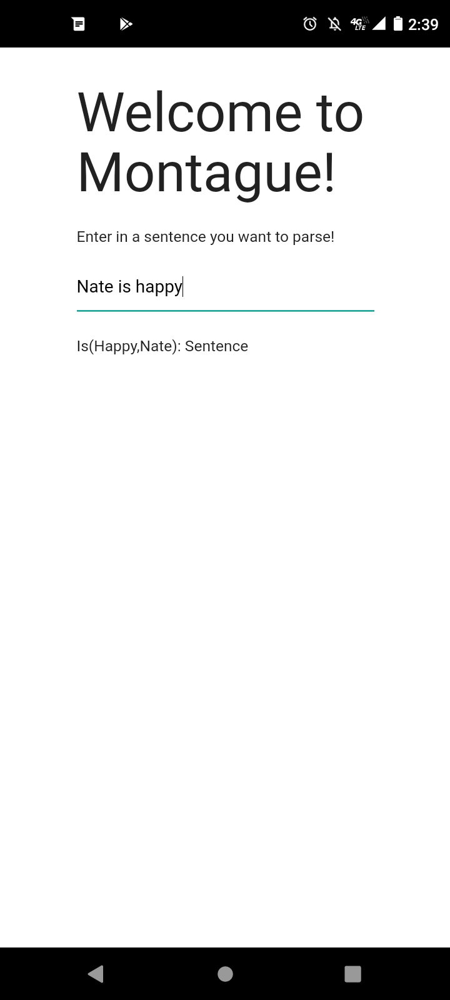

# montague-reflex

Montague-reflex is a simple [reflex](https://reflex-frp.org/) front-end for [Montague](https://github.com/Sintrastes/Montague). 

# Building/Installing

Montague-reflex is built with [nix](https://nixos.org/) and optionally [obelisk](https://github.com/obsidiansystems/obelisk/), so make sure those are installed first. 

After nix is installed, to build an Android APK for Montague, just run `nix-build -A android.frontend -o result-android` at the root of this repo. This builds a symlink `result-android` at the root of the repo pointing to a directory with a built `android-app-debug.apk`.

To instead build a web front-end, you can run `nix-build -A ghcjs.frontend -o result-frontend`. The symlink `result-frontend` will contain a `frontend.jsexe` directory with all of the compiled `js` files needed to run the application, and a small `index.html` file that can be used to bootstrap the app. Note that the `css` files used by Montague may need to be manually added to this `index.html` file in order for everything to display properly.

If you have `ob` installed, a simple web server for testing out the app locally (at http://localhost:8000/ by default) can also be run by executing `ob run`.
